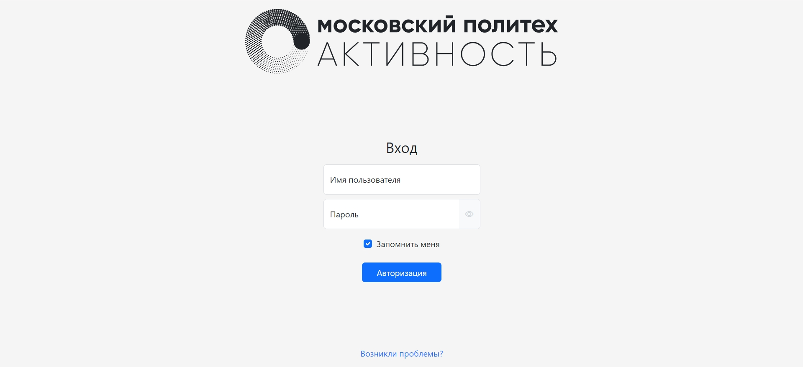
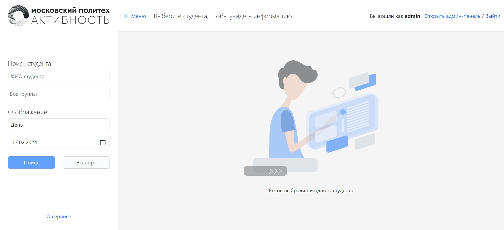
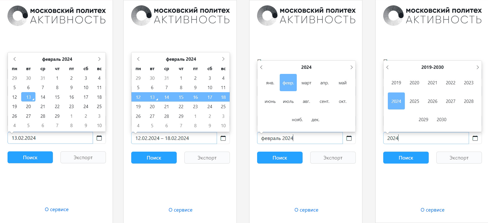
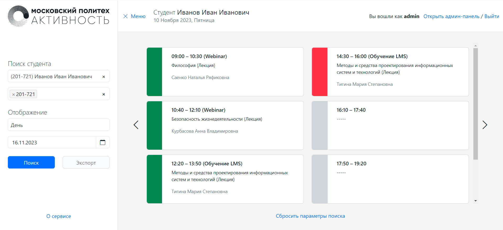
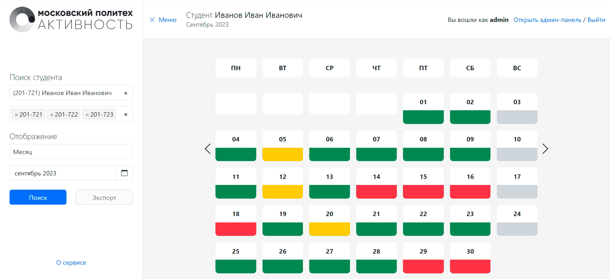
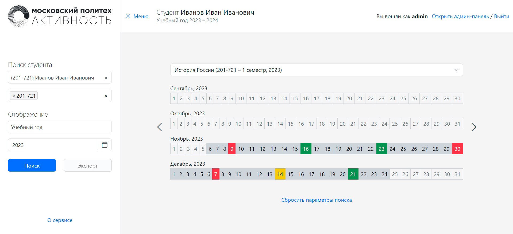
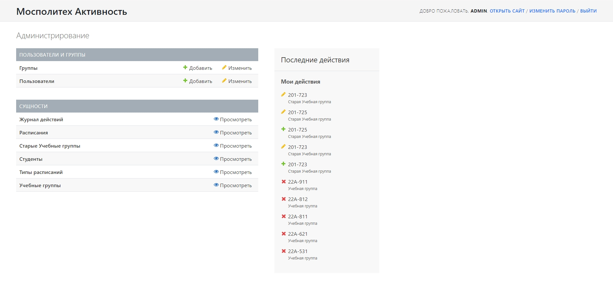
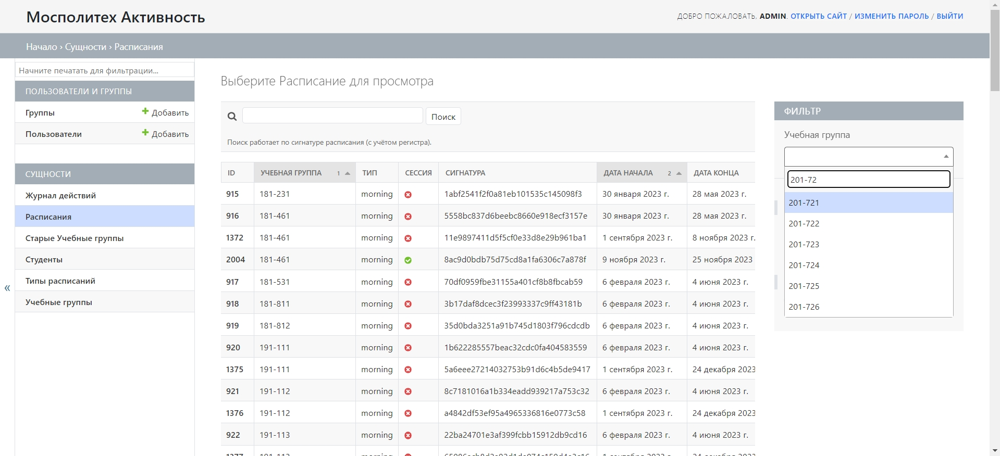
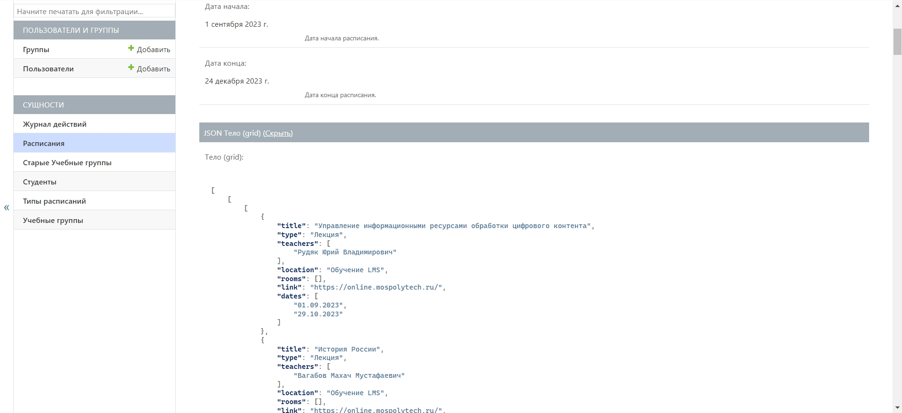

# Mospolytech Activity

## О проекте

__Мосполитех.Активность__ – информационная система (web-приложение) для работников [Московского Политехнического Университета](https://mospolytech.ru/), предоставляющая в удобном для анализа виде информацию о посещениях студентами ВУЗа.


## Использование

Для работы проекта необходимы сторонние зависимости.

```
pip install -r /path/to/requirements.txt
```

Требуемые зависимости:

1. django==4.1.5
2. django-admin-autocomplete-filter==0.7.1
3. django-autocomplete-light==3.9.4
4. django-bootstrap-datepicker-plus==5.0.3
5. django4-background-tasks==1.2.7
6. pygments==2.14.0
7. python-decouple==3.7
8. requests==2.28.2


## Изображения

__Авторизация__ – система является закрытой.


__Главный экран__ – начальная страница, с которой осуществляется поиск необходимой информации.


__Фильтры__ – примеры различных фильтров по датам.


__Виджет дня__ – отображение активности студента за выбранный день.


__Виджет месяца__ – отображение активности студента за выбранный месяц.


__Виджет учебного года__ – отображение активности студента за выбранный учебный год (с возможностью просматривать посещения по отдельным предметам).


__Админ-панель__ – панель для управления пользователями и данными(страница навигации).


__Админ-панель__ – панель для управления пользователями и данными(список расписаний).


__Админ-панель__ – панель для управления пользователями и данными(детальная информация о расписании).



## Контакты

Если вы хотите помочь в разработке или у вас есть вопросы, вы можете связаться с создателем репозитория ([@rand0lphc](https://t.me/rand0lphc)) в telegram.
